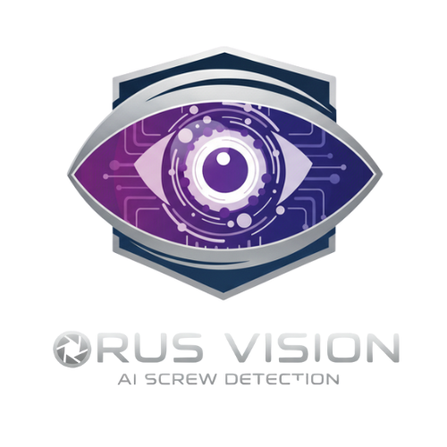

# 🔩 Sistema de Detección de Tornillos - ORUS VISION



Sistema de control de calidad automatizado mediante visión artificial para líneas de ensamblaje industrial. Utiliza Deep Learning (YOLOv8) para detectar y validar tornillos en tiempo real, reduciendo errores humanos y aumentando la eficiencia productiva.

---

## ✨ Características Principales

- **🎯 Detección en Tiempo Real:** Modelo YOLOv8 optimizado con 98.5% de precisión
-   **Ciclo de Inspección Inteligente:** Implementa un sistema de inspección por ciclos configurables, acumulando el conteo máximo de detecciones para mayor precisión en entornos dinámicos.
- **📊 Panel de Control Dinámico:** Estadísticas de producción, gráficos y tendencias
- **⚙️ Gestión Multi-Modelo:** Configuración de diferentes perfiles por producto (LIKON, KELVINATOR, etc.)
- **👥 Sistema de Roles:** Admin, Supervisor, Operador con permisos granulares
- **🔄 Tracking Inteligente:** Sistema híbrido IoU + Distancia euclidiana para seguimiento preciso
- **📹 Soporte Multi-Cámara:** Compatible con USB, IP Camera, RTSP streams
- **📈 Historial Completo:** Registro de inspecciones con imágenes y trazabilidad
- **🐳 Distribución Docker:** Instalación automática sin configuración manual

---

## 🚀 Stack Tecnológico

| Capa | Tecnología |
|------|-----------|
| **Backend** | Python 3.11+, Flask 3.0, Gunicorn |
| **Frontend** | HTML5, CSS3 (Glassmorphism), Vanilla JavaScript |
| **IA/Visión** | Ultralytics YOLOv8, OpenCV 4.8, PyTorch |
| **Base de Datos** | PostgreSQL 15 (producción), SQLite (desarrollo) |
| **ORM** | SQLAlchemy 2.0, Flask-Migrate (Alembic) |
| **Autenticación** | JWT (Flask-JWT-Extended) |
| **Deployment** | Docker + Docker Compose, Nginx |

---

## 📦 Instalación Rápida (Docker - RECOMENDADO)

### Requisitos Previos
- Docker Desktop 4.20+ ([Descargar](https://www.docker.com/products/docker-desktop))
- GPU NVIDIA (opcional pero recomendado) con drivers 525+
- 8GB RAM mínimo, 16GB recomendado

### Opción 1: Instalación Automática

**Windows:**
```powershell
# Ejecutar como Administrador
.\install.ps1
```

**Linux:**
```bash
sudo bash install.sh
```

### Opción 2: Instalación Manual

```bash
# 1. Clonar repositorio
git clone https://github.com/DPETP/tornillo-detector.git
cd tornillo-detector

# 2. Configurar variables de entorno
cp .env.example .env
# Editar .env con tus valores

# 3. Iniciar servicios
docker-compose up -d

# 4. Inicializar base de datos
docker-compose exec web flask db upgrade

# 5. (Opcional) Cargar datos de ejemplo
docker-compose exec web python backend/seed_db.py
```

### Acceder al Sistema
- **URL:** http://localhost
- **Usuario por defecto:** `admin`
- **Contraseña por defecto:** `admin123`

⚠️ **IMPORTANTE:** Cambiar credenciales en primer acceso

---

## 🏗️ Arquitectura del Sistema

```
┌─────────────────────────────────────────────────┐
│          FRONTEND (Cliente Web)                 │
│  HTML5 + CSS3 (Glassmorphism) + Vanilla JS     │
│  - detector.js (tracking IoU + distancia)       │
│  - admin.js (gestión modelos/usuarios)          │
│  - dashboard.js (estadísticas tiempo real)      │
└─────────────────────────────────────────────────┘
                     ↕ (API REST + JWT)
┌─────────────────────────────────────────────────┐
│          BACKEND (Servidor Flask)               │
│  - routes/detection.py (inferencia YOLO)        │
│  - routes/admin.py (CRUD modelos)               │
│  - routes/dashboard.py (estadísticas)           │
│  - vision/detector.py (wrapper YOLOv8)          │
└─────────────────────────────────────────────────┘
        ↕ (SQLAlchemy)              ↕ (PyTorch)
┌──────────────────────┐    ┌───────────────────┐
│  PostgreSQL Database │    │  Modelo YOLOv8    │
│  - Usuarios          │    │  best.pt (5.93MB) │
│  - ACModels          │    │  conf=0.10        │
│  - Inspecciones      │    │  iou=0.45         │
└──────────────────────┘    └───────────────────┘
```

### Componentes Clave:
- **YOLODetector:** Wrapper de Ultralytics con parámetros optimizados
- **Tracking System:** IoU threshold 0.3 + Distancia 150px + confirmación 2 frames
- **InferenceEngine:** Gestión de modelos activos desde base de datos
- **Frame Sync:** Canvas lastProcessedFrame para eliminar desfase visual

---

## 📁 Estructura del Proyecto

```
tornillo-detector/
├── backend/
│   ├── database/
│   │   ├── models.py              # Modelos SQLAlchemy (User, ACModel, Inspection)
│   │   └── env_config.py          # Configuración DB
│   ├── routes/
│   │   ├── detection.py           # Endpoints de inferencia YOLO
│   │   ├── admin.py               # CRUD usuarios/modelos
│   │   ├── dashboard.py           # Estadísticas
│   │   └── history.py             # Historial inspecciones
│   ├── vision/
│   │   └── detector.py            # Wrapper YOLOv8
│   ├── static/
│   │   ├── css/                   # Estilos (glassmorphism)
│   │   ├── js/                    # Lógica frontend
│   │   └── assets/                # Imágenes/logos
│   ├── templates/                 # HTML (Jinja2)
│   ├── uploads/                   # Modelos .pt subidos
│   ├── app.py                     # Application Factory
│   ├── config.py                  # Configuración Flask
│   └── requirements.txt           # Dependencias Python
├── migrations/                    # Scripts Alembic
├── docker-compose.yml             # Orquestación servicios
├── Dockerfile                     # Imagen Python + YOLO
├── nginx.conf                     # Reverse proxy
├── install.ps1                    # Instalador Windows
├── install.sh                     # Instalador Linux
├── create-package.ps1             # Generador paquetes
├── INSTALL.md                     # Guía instalación detallada
├── DISTRIBUTION.md                # Estrategias distribución
└── README.md                      # Este archivo
```

---

## 🔧 Desarrollo Local (sin Docker)

### Prerrequisitos
- Python 3.11+
- PostgreSQL 15+ (o SQLite para pruebas)
- Git

### Instalación

```bash
# 1. Clonar repositorio
git clone https://github.com/DPETP/tornillo-detector.git
cd tornillo-detector

# 2. Crear entorno virtual
python -m venv venv
# Windows:
.\venv\Scripts\Activate.ps1
# Linux/Mac:
source venv/bin/activate

# 3. Instalar dependencias
pip install -r backend/requirements.txt

# 4. Configurar variables de entorno
cp .env.example .env
# Editar DATABASE_URL, SECRET_KEY, etc.

# 5. Inicializar base de datos
# 5. Inicializar base de datos
cd backend
flask db upgrade
python seed_db.py  # Crear usuario admin y datos de ejemplo

# 6. Ejecutar servidor
flask run --host=0.0.0.0 --port=5000
```

**Acceder:** http://localhost:5000

---

## 📦 Distribución a Clientes

### Generar Paquete Instalable

```powershell
# Crear paquete ZIP con instalador
.\create-package.ps1 -Version "1.0.0"

# Resultado: dist/tornillo-detector-v1.0.0.zip
```

### El Cliente Recibe:
1. Archivo ZIP con todo incluido
2. Instrucciones en `INSTALL.md`
3. Ejecuta `install.ps1` (Windows) o `install.sh` (Linux)
4. Sistema listo en minutos sin configuración manual

Ver **[DISTRIBUTION.md](DISTRIBUTION.md)** para opciones avanzadas (instalador .exe, Docker Hub, USB booteable).

---

## 🎯 Uso del Sistema

### 1. Login
- Acceder a http://localhost
- Ingresar credenciales (admin/admin123 por defecto)

### 2. Configurar Modelo de AC
**Admin → Configuración:**
- Nombre: `LIKON`
- Tornillos objetivo: `5`
- Tiempo de ciclo: `10` segundos
- Confianza mínima: `0.25`

### 3. Subir Modelo YOLO
**Admin → Configuración → Modelos de IA:**
- Subir archivo `.pt` (ej: `best.pt`)
- Activar modelo
- Sistema carga automáticamente

### 4. Realizar Inspección
**Detección:**
- Permitir acceso a cámara web
- Posicionar pieza frente a cámara
- Sistema detecta tornillos en tiempo real
- Al finalizar ciclo muestra: ✅ PASS o ❌ FAIL

### 5. Ver Estadísticas
**Dashboard:**
- Total inspecciones del día
- Tasa de aprobación/rechazo
- Gráfico de tendencias
- Filtros por fecha/modelo

---

## 🔑 Roles y Permisos

| Rol | Dashboard | Detección | Configuración | Historial |
|-----|-----------|-----------|---------------|-----------|
| **Operador** | ❌ | ✅ | ❌ | ❌ |
| **Supervisor** | ✅ | ✅ | ❌ | ✅ |
| **Admin** | ✅ | ✅ | ✅ | ✅ |

---

## 📊 Métricas de Performance

- **Latencia de inferencia:** 80-120ms por frame
- **FPS efectivo:** 12-15 fps (procesamiento 1 de cada 2 frames)
- **Precisión:** 98.5% en condiciones controladas
- **Falsos negativos:** <1.5%
- **Tiempo de ciclo:** Configurable (típicamente 8-15 segundos)

---

## 🛠️ Comandos Útiles

### Docker
```bash
# Ver logs en tiempo real
docker-compose logs -f web

# Reiniciar servicios
docker-compose restart

# Detener todo
docker-compose down

# Reconstruir imágenes
docker-compose build --no-cache

# Ejecutar comando en contenedor
docker-compose exec web flask db upgrade
```

### Base de Datos
```bash
# Crear nueva migración
flask db migrate -m "descripción del cambio"

# Aplicar migraciones
flask db upgrade

# Revertir migración
flask db downgrade

# Ver historial
flask db history
```

---

## 🐛 Troubleshooting

### Error: "Model file not found"
**Solución:** Verificar que el archivo `.pt` esté en `backend/uploads/` y la ruta en DB no tenga prefijo `uploads/`.

### Error: "CUDA not available"
**Solución:** 
1. Verificar drivers NVIDIA: `nvidia-smi`
2. Instalar NVIDIA Container Toolkit
3. Reiniciar Docker

### Puerto 5000 ocupado
**Solución:** Cambiar puerto en `docker-compose.yml` o matar proceso:
```powershell
# Windows
Get-Process -Id (Get-NetTCPConnection -LocalPort 5000).OwningProcess | Stop-Process

# Linux
sudo lsof -t -i:5000 | xargs kill -9
```

---

## 🤝 Contribuciones

Las contribuciones son bienvenidas. Por favor:
1. Fork el repositorio
2. Crear branch: `git checkout -b feature/nueva-funcionalidad`
3. Commit: `git commit -m 'feat: descripción'`
4. Push: `git push origin feature/nueva-funcionalidad`
5. Abrir Pull Request

---

## 📄 Licencia

© 2025 BGH - Sistema Propietario de Inspección Automatizada

---

## 📞 Soporte

- **Documentación:** Ver [INSTALL.md](INSTALL.md) para guía completa
- **Issues:** https://github.com/DPETP/tornillo-detector/issues
- **Email:** soporte@bgh.com.ar

---

## 🎓 Créditos

Desarrollado por el equipo de Ingeniería de BGH utilizando:
- [Ultralytics YOLOv8](https://github.com/ultralytics/ultralytics)
- [Flask Framework](https://flask.palletsprojects.com/)
- [OpenCV](https://opencv.org/)

---

**⭐ Si este proyecto te fue útil, considerá darle una estrella en GitHub!**

Este proyecto es una base sólida con un gran potencial de crecimiento. Las próximas mejoras planificadas incluyen:

-   [ ] **Módulo de Reportes:** Desarrollar una interfaz para visualizar, filtrar y exportar el historial de inspecciones.
-   [ ] **WebSockets:** Migrar la transmisión de video a WebSockets para reducir la latencia.
-   [ ] **Ciclo de Reentrenamiento:** Implementar una función para que los operarios capturen imágenes de casos difíciles, facilitando la mejora continua del modelo de IA.
-   [ ] **Dashboard con Gráficos:** Añadir visualizaciones de datos (ej. con Chart.js) para analizar tendencias de producción.

---

Desarrollado por Equipo de Practicas Profesionalizantes:
-   [ ] **Mamani, Rafael.** - **Saldivia, Eduardo.** - **Demari, Monica.** - **Iñigo, Abigail.** - **Saldivia, Eduardo.** 
